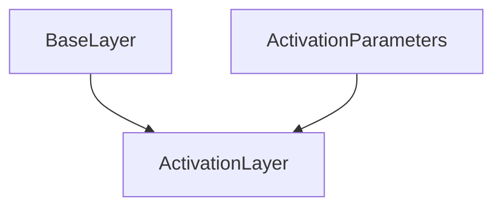

# ActivationLayer Class Documentation

[Return to `README`](/README.md)

The `ActivationLayer` class is a part of the `nn` namespace and is a template class that represents a layer with an activation function in a neural network.

## References

- [`Shape`](/docs/core/shape.md)
- [`Tensor`](/docs/core/tensor.md)
- [`BaseLayer`](/docs/layer/base.md)
- [`NodeLayer`](/docs/layer/node.md)

## Diagram


## Inheritance



## Activation Types

- `ActivationType::sigmoid`: Sigmoid activation function.
- `ActivationType::tanh`: Hyperbolic tangent activation function.
- `ActivationType::relu`: Rectified linear unit activation function.
- `ActivationType::swish`: Swish activation function.
- `ActivationType::leaky_relu`: Leaky rectified linear unit activation function.
- `ActivationType::elu`: Exponential linear unit activation function.
- `ActivationType::eswish`: Exponential swish activation function.

## Parameter Modes

- `ParameterMode::none`: No parameters.
- `ParameterMode::layer_wise`: Layer-wise parameters.
- `ParameterMode::channel_wise`: Channel-wise parameters.
- `ParameterMode::element_wise`: Element-wise parameters.

## Template Parameters

- `T`: The data type of the layer's parameters.
- `A`: The activation type of the layer.
- `M`: The parameter mode of the layer.

## Template

- `ActivationLayer<typename T, ActivationType A, ParameterMode M>`

## Activation Specializations

- `ActivationLayer<T, ActivationType::sigmoid,      ParameterMode::none>`
- `ActivationLayer<T, ActivationType::tanh,         ParameterMode::none>`
- `ActivationLayer<T, ActivationType::relu,         ParameterMode::none>`
- `ActivationLayer<T, ActivationType::swish,        ParameterMode::none>`
- `ActivationLayer<T, ActivationType::leaky_relu,   ParameterMode::layer_wise>`
- `ActivationLayer<T, ActivationType::leaky_relu,   ParameterMode::channel_wise>`
- `ActivationLayer<T, ActivationType::leaky_relu,   ParameterMode::element_wise>`
- `ActivationLayer<T, ActivationType::elu,          ParameterMode::layer_wise>`
- `ActivationLayer<T, ActivationType::elu,          ParameterMode::channel_wise>`
- `ActivationLayer<T, ActivationType::elu,          ParameterMode:::element_wise>`
- `ActivationLayer<T, ActivationType::eswish,       ParameterMode::layer_wise>`
- `ActivationLayer<T, ActivationType::eswish,       ParameterMode::channel_wise>`
- `ActivationLayer<T, ActivationType::eswish,       ParameterMode::element_wise>`

## Members

- `static const ActivationType type`: The activation type of the layer.
- `static const ParameterMode mode`: The parameter mode of the layer.

- If `M == ParameterMode::layer_wise`:
    - `T parameter`: The layer-wise parameter of the layer.
    - `T jacobian`: The layer-wise jacobian of the layer.
    - `T momentum`: The layer-wise momentum of the layer.
    - `T velocity`: The layer-wise velocity of the layer.

- If `M == ParameterMode::channel_wise` or `M == ParameterMode::element_wise`:
    - `Tensor<T, 4> parameters`: The channel-wise or element-wise parameters of the layer.
    - `Tensor<T, 4> jacobian`: The channel-wise or element-wise jacobian of the layer.
    - `Tensor<T, 4> momentum`: The channel-wise or element-wise momentum of the layer.
    - `Tensor<T, 4> velocity`: The channel-wise or element-wise velocity of the layer.

## Constructors

```
ActivationLayer() requires ( is_type<T, none>::value && ( M == ParameterMode::none ) )
```
- Constructs an `ActivationLayer` with no parameters.

```
ActivationLayer( const T parameter ) requires ( !is_type<T, none>::value && ( M == ParameterMode::layer_wise ) )
```
- Constructs an `ActivationLayer` with a layer-wise parameter.

```
ActivationLayer( const u8 channels, const T parameter ) requires ( !is_type<T, none>::value && ( M == ParameterMode::channel_wise ) )
```
- Constructs an `ActivationLayer` with channel-wises parameters from a scalar.

```
ActivationLayer( const u8 channels, const std::vector<T>& data ) requires ( !is_type<T, none>::value && ( M == ParameterMode::channel_wise ) )
```
- Constructs an `ActivationLayer` with channel-wise parameters from a vector.

```
ActivationLayer( const Shape<4>& shape, const T parameter ) requires ( !is_type<T, none>::value && ( M == ParameterMode::element_wise ) )
```
- Constructs an `ActivationLayer` with element-wise parameters from a scalar.

```
ActivationLayer( const Shape<4>& shape, const std::vector<T>& data ) requires ( !is_type<T, none>::value && ( M == ParameterMode::element_wise ) )
```
- Constructs an `ActivationLayer` with element-wise parameters from a vector.

## Destructors

```
virtual ~ActivationLayer()
```
- Destructs an `ActivationLayer`.

## Methods

### Set Training Mode
```
void set_training_mode( const TrainingMode training_mode ) requires ( !is_type<T, none>::value && ( ( M == ParameterMode::channel_wise ) || ( M == ParameterMode::element_wise ) ) )
```
- Sets the training mode of the `ActivationLayer`.

### Get Shape
```
const Shape<4>& get_shape() const requires ( !is_type<T, none>::value && ( ( M == ParameterMode::channel_wise ) || ( M == ParameterMode::element_wise ) ) )
```
- Returns the shape of the `ActivationLayer`.

### Get Size
```
Size get_size() const requires ( !is_type<T, none>::value && ( ( M == ParameterMode::channel_wise ) || ( M == ParameterMode::element_wise ) ) )
```
- Returns the size of the `ActivationLayer`.

### Get Parameter
```
T get_parameter() const requires ( !is_type<T, none>::value && ( M == ParameterMode::layer_wise ) )
```
- Returns the layer-wise parameter of the `ActivationLayer`.

### Get Jacobian
```
T get_jacobian() const requires ( !is_type<T, none>::value && ( M == ParameterMode::layer_wise ) )
```
- Returns the layer-wise jacobian of the `ActivationLayer`.

### Get Momentum
```
T get_momentum() const requires ( !is_type<T, none>::value && ( M == ParameterMode::layer_wise ) )
```
- Returns the layer-wise momentum of the `ActivationLayer`.

### Get Velocity
```
T get_velocity() const requires ( !is_type<T, none>::value && ( M == ParameterMode::layer_wise ) )
```
- Returns the layer-wise velocity of the `ActivationLayer`.

### Get Parameters
```
const Tensor<T, 4>& get_parameters() const requires ( !is_type<T, none>::value && ( ( M == ParameterMode::channel_wise ) || ( M == ParameterMode::element_wise ) ) )
```
- Returns the channel-wise or element-wise parameters tensor of the `ActivationLayer`.

### Get Jacobian
```
const Tensor<T, 4>& get_jacobian() const requires ( !is_type<T, none>::value && ( ( M == ParameterMode::channel_wise ) || ( M == ParameterMode::element_wise ) ) )
```
- Returns the channel-wise or element-wise jacobian tensor of the `ActivationLayer`.

### Get Momentum
```
const Tensor<T, 4>& get_momentum() const requires ( !is_type<T, none>::value && ( ( M == ParameterMode::channel_wise ) || ( M == ParameterMode::element_wise ) ) )
```
- Returns the channel-wise or element-wise momentum tensor of the `ActivationLayer`.

### Get Velocity
```
const Tensor<T, 4>& get_velocity() const requires ( !is_type<T, none>::value && ( ( M == ParameterMode::channel_wise ) || ( M == ParameterMode::element_wise ) ) )
```
- Returns the channel-wise or element-wise velocity tensor of the `ActivationLayer`.

### Reshape
```
void reshape( const u8 channels ) requires ( !is_type<T, none>::value && ( M == ParameterMode::channel_wise ) )
```
- Reshapes the channel-wise `ActivationLayer`.

### Reshape
```
void reshape( const Shape<4>& shape ) requires ( !is_type<T, none>::value && ( M == ParameterMode::element_wise ) )
```
- Reshapes the element-wise `ActivationLayer`.

### Resize
```
void resize( const u8 channels ) requires ( !is_type<T, none>::value && ( M == ParameterMode::channel_wise ) )
```
- Resizes the channel-wise `ActivationLayer`.

### Resize
```
void resize( const Shape<4>& shape ) requires ( !is_type<T, none>::value && ( M == ParameterMode::element_wise ) )
```
- Resizes the element-wise `ActivationLayer`.

### Set Parameter
```
void set_parameter( const T value ) requires ( !is_type<T, none>::value && ( M == ParameterMode::layer_wise ) )
```
- Sets the layer-wise parameter of the `ActivationLayer`.

### Fill Parameters
```
void fill_parameters( const T value ) requires ( !is_type<T, none>::value && ( ( M == ParameterMode::channel_wise ) || ( M == ParameterMode::element_wise ) ) )
```
- Fills the channel-wise or element-wise parameters of the `ActivationLayer` with the specified value.

### Zero Parameter
```
void zero_parameter() requires ( !is_type<T, none>::value && ( M == ParameterMode::layer_wise ) )
```
- Sets the layer-wise parameter of the `ActivationLayer` to zero.

### Zero Parameters
```
void zero_parameters() requires ( !is_type<T, none>::value && ( ( M == ParameterMode::channel_wise ) || ( M == ParameterMode::element_wise ) ) )
```
- Sets all channel-wise or element-wise parameters of the `ActivationLayer` to zero.

### Randomize Parameter
```
void randomize_parameter( const T min, const T max ) requires ( !is_type<T, none>::value && ( M == ParameterMode::layer_wise ) )
```
- Randomizes the layer-wise parameter of the `ActivationLayer` within the specified range.

### Randomize Parameters
```
void randomize_parameters( const T min, const T max ) requires ( !is_type<T, none>::value && ( ( M == ParameterMode::channel_wise ) || ( M == ParameterMode::element_wise ) ) )
```
- Randomizes all channel-wise or element-wise parameters of the `ActivationLayer` within the specified range.

### Inference
```
template <typename U> Error inference( NodeLayer<U>& layer ) const requires ( is_type<T, none>::value && ( M == ParameterMode::none ) )
```
- Performs inference on the `ActivationLayer` with no parameters.

### Inference
```
template <typename U> Error inference( NodeLayer<U>& layer ) const requires ( !is_type<T, none>::value && ( M == ParameterMode::layer_wise ) )
```
- Performs inference on the `ActivationLayer` with a layer-wise parameter.

### Inference
```
template <typename U> Error inference( NodeLayer<U>& layer ) const requires ( !is_type<T, none>::value && ( M == ParameterMode::channel_wise ) )
```
- Performs inference on the `ActivationLayer` with a channel-wise parameter.

### Inference
```
template <typename U> Error inference( NodeLayer<U>& layer ) const requires ( !is_type<T, none>::value && ( M == ParameterMode::element_wise ) )
```
- Performs inference on the `ActivationLayer` with an element-wise parameter.

### Backpropagation
```
template <typename U> Error backpropagation( NodeLayer<U>& layer ) requires ( is_type<T, none>::value && ( M == ParameterMode::none ) )
```
- Performs backpropagation on the `ActivationLayer` with no parameters.

### Backpropagation
```
template <typename U> Error backpropagation( NodeLayer<U>& layer ) requires ( !is_type<T, none>::value && ( M == ParameterMode::layer_wise ) )
```
- Performs backpropagation on the `ActivationLayer` with a layer-wise parameter.

### Backpropagation
```
template <typename U> Error backpropagation( NodeLayer<U>& layer ) requires ( !is_type<T, none>::value && ( M == ParameterMode::channel_wise ) )
```
- Performs backpropagation on the `ActivationLayer` with a channel-wise parameter.

### Backpropagation
```
template <typename U> Error backpropagation( NodeLayer<U>& layer ) requires ( !is_type<T, none>::value && ( M == ParameterMode::element_wise ) )
```
- Performs backpropagation on the `ActivationLayer` with an element-wise parameter.

### Gradient Descent Normal
```
Error gradient_decent_normal( const Dim batch_size, const StepSize step_size ) requires ( !is_type<T, none>::value && ( M == ParameterMode::layer_wise) )
```
- Performs gradient descent with normal update rule on the `ActivationLayer` with a layer-wise parameter.

### Gradient Descent Normal
```
Error gradient_decent_normal( const Dim batch_size, const StepSize step_size ) requires ( !is_type<T, none>::value && ( ( M == ParameterMode::channel_wise ) || ( M == ParameterMode::element_wise ) ) )
```
- Performs gradient descent with normal update rule on the `ActivationLayer` with a channel-wise or element-wise parameter.

### Gradient Descent Momentum
```
Error gradient_decent_momentum( const Dim batch_size, const StepSize step_size, const StepSize momentum_step_size ) requires ( !is_type<T, none>::value && ( M == ParameterMode::layer_wise) )
```
- Performs gradient descent with momentum update rule on the `ActivationLayer` with a layer-wise parameter.

### Gradient Descent Momentum
```
Error gradient_decent_momentum( const Dim batch_size, const StepSize step_size, const StepSize momentum_step_size ) requires ( !is_type<T, none>::value && ( ( M == ParameterMode::channel_wise ) || ( M == ParameterMode::element_wise ) ) )
```
- Performs gradient descent with momentum update rule on the `ActivationLayer` with a channel-wise or element-wise parameter.

### Gradient Descent Adam
```
Error gradient_decent_adam( const Dim batch_size, const StepSize step_size, const Beta beta1, const Beta beta2, const Epsilon epsilon ) requires ( !is_type<T, none>::value && ( M == ParameterMode::layer_wise) )
```
- Performs gradient descent with Adam update rule on the `ActivationLayer` with a layer-wise parameter.

### Gradient Descent Adam
```
Error gradient_decent_adam( const Dim batch_size, const StepSize step_size, const Beta beta1, const Beta beta2, const Epsilon epsilon ) requires ( !is_type<T, none>::value && ( ( M == ParameterMode::channel_wise ) || ( M == ParameterMode::element_wise ) ) )
```
- Performs gradient descent with Adam update rule on the `ActivationLayer` with a channel-wise or element-wise parameter.

## Operators

### Get Parameter
```
inline T get_parameter( const Dim4D& indices ) const requires ( !is_type<T, none>::value && ( ( M == ParameterMode::channel_wise ) || ( M == ParameterMode::element_wise ) ) )
```
- Returns the value of the parameter at the specified coordinates.

### Get Jacobian
```
inline T get_jacobian( const Dim4D& indices ) const requires ( !is_type<T, none>::value && ( ( M == ParameterMode::channel_wise ) || ( M == ParameterMode::element_wise ) ) )
```
- Returns the value of the jacobian at the specified coordinates.

### Get Momentum
```
inline T get_momentum( const Dim4D& indices ) const requires ( !is_type<T, none>::value && ( ( M == ParameterMode::channel_wise ) || ( M == ParameterMode::element_wise ) ) )
```
- Returns the value of the momentum at the specified coordinates.

### Get Velocity
```
inline T get_velocity( const Dim4D& indices ) const requires ( !is_type<T, none>::value && ( ( M == ParameterMode::channel_wise ) || ( M == ParameterMode::element_wise ) ) )
```
- Returns the value of the velocity at the specified coordinates.

### Get Parameter
```
inline T get_parameter( const Idx index ) const requires ( !is_type<T, none>::value && ( ( M == ParameterMode::channel_wise ) || ( M == ParameterMode::element_wise ) ) )
```
- Returns the value of the parameter at the specified index.

### Get Jacobian
```
inline T get_jacobian( const Idx index ) const requires ( !is_type<T, none>::value && ( ( M == ParameterMode::channel_wise ) || ( M == ParameterMode::element_wise ) ) )
```
- Returns the value of the jacobian at the specified index.

### Get Momentum
```
inline T get_momentum( const Idx index ) const requires ( !is_type<T, none>::value && ( ( M == ParameterMode::channel_wise ) || ( M == ParameterMode::element_wise ) ) )
```
- Returns the value of the momentum at the specified index.

### Get Velocity
```
inline T get_velocity( const Idx index ) const requires ( !is_type<T, none>::value && ( ( M == ParameterMode::channel_wise ) || ( M == ParameterMode::element_wise ) ) )
```
- Returns the value of the velocity at the specified index.

### Get Parameter Reference
```
inline T& get_parameter( const Dim4D& indices ) requires ( !is_type<T, none>::value && ( ( M == ParameterMode::channel_wise ) || ( M == ParameterMode::element_wise ) ) )
```
- Returns a reference to the parameter at the specified coordinates.

### Get Parameter Reference
```
inline T& get_parameter( const Idx index ) requires ( !is_type<T, none>::value && ( ( M == ParameterMode::channel_wise ) || ( M == ParameterMode::element_wise ) ) )
```
- Returns a reference to the parameter at the specified index.

### Get Jacobian Reference
```
inline T& get_jacobian( const Dim4D& indices ) requires ( !is_type<T, none>::value && ( ( M == ParameterMode::channel_wise ) || ( M == ParameterMode::element_wise ) ) )
```
- Returns a reference to the jacobian at the specified coordinates.

### Get Momentum Reference
```
inline T& get_momentum( const Dim4D& indices ) requires ( !is_type<T, none>::value && ( ( M == ParameterMode::channel_wise ) || ( M == ParameterMode::element_wise ) ) )
```
- Returns a reference to the momentum at the specified coordinates.

### Get Velocity Reference
```
inline T& get_velocity( const Dim4D& indices ) requires ( !is_type<T, none>::value && ( ( M == ParameterMode::channel_wise ) || ( M == ParameterMode::element_wise ) ) )
```
- Returns a reference to the velocity at the specified coordinates.

### Get Jacobian Reference
```
inline T& get_jacobian( const Idx index ) requires ( !is_type<T, none>::value && ( ( M == ParameterMode::channel_wise ) || ( M == ParameterMode::element_wise ) ) )
```
- Returns a reference to the jacobian at the specified index.

### Get Momentum Reference
```
inline T& get_momentum( const Idx index ) requires ( !is_type<T, none>::value && ( ( M == ParameterMode::channel_wise ) || ( M == ParameterMode::element_wise ) ) )
```
- Returns a reference to the momentum at the specified index.

### Get Velocity Reference
```
inline T& get_velocity( const Idx index ) requires ( !is_type<T, none>::value && ( ( M == ParameterMode::channel_wise ) || ( M == ParameterMode::element_wise ) ) )
```
- Returns a reference to the velocity at the specified index.

[Return to `README`](/README.md)