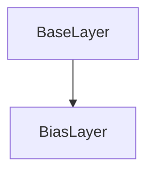

# BiasLayer Class Documentation

[Return to `README`](/README.md)

The `BiasLayer` class is a part of the `nn` namespace and is a template class that represents a layer with bias parameters in a neural network.

## References

- [`Shape`](/docs/core/shape.md)
- [`Tensor`](/docs/core/tensor.md)
- [`BaseLayer`](/docs/layer/base.md)
- [`NodeLayer`](/docs/layer/node.md)

## Diagram


## Inheritance



## Template Parameters

- `T`: The data type of the layer's parameters.

## Template

- `BiasLayer<typename T>`

## Members

- `Tensor<T, 4> bias`: The bias parameters of the layer.
- `Tensor<T, 4> jacobian`: The jacobian of the layer.
- `Tensor<T, 4> momentum`: The momentum of the layer.
- `Tensor<T, 4> velocity`: The velocity of the layer.

## Constructors

```
BiasLayer(const Shape<4>& shape = Shape<4>({ 0 }), const T scalar = T())
```
- Constructs a `BiasLayer` with the specified shape and initializes the bias parameters with the specified scalar value.

```
BiasLayer(const Shape<4>& shape, const std::vector<T>& data)
```
- Constructs a `BiasLayer` with the specified shape and initializes the bias parameters with the specified data.

## Destructors

```
virtual ~BiasLayer()
```
- Destructs a `BiasLayer`.

## Methods

### Reshape
```
void reshape(const Shape<4>& shape)
```
- Reshapes the `BiasLayer` to the specified shape.

### Resize
```
void resize(const Shape<4>& shape)
```
- Resizes the `BiasLayer` to the specified shape.

### Set Training Mode
```
void set_training_mode(const TrainingMode training_mode)
```
- Sets the training mode of the `BiasLayer`.

### Get Shape
```
const Shape<4>& get_shape() const
```
- Returns the shape of the `BiasLayer`.

### Get Size
```
Size get_size() const
```
- Returns the size of the `BiasLayer`.

### Get Bias
```
const Tensor<T, 4>& get_bias() const
```
- Returns the bias parameters of the `BiasLayer`.

### Get Jacobian
```
const Tensor<T, 4>& get_jacobian() const
```
- Returns the jacobian of the `BiasLayer`.

### Get Momentum
```
const Tensor<T, 4>& get_momentum() const
```
- Returns the momentum of the `BiasLayer`.

### Get Velocity
```
const Tensor<T, 4>& get_velocity() const
```
- Returns the velocity of the `BiasLayer`.

### Fill Bias
```
void fill_bias(const T value)
```
- Fills the bias parameters of the `BiasLayer` with the specified value.

### Zero Bias
```
void zero_bias()
```
- Sets all bias parameters of the `BiasLayer` to zero.

### Randomize Bias
```
void randomize_bias(const T min, const T max)
```
- Randomizes the bias parameters of the `BiasLayer` within the specified range.

### Inference
```
template <typename U> Error inference(NodeLayer<U>& layer) const
```
- Performs inference on the `BiasLayer`.

### Backpropagation
```
template <typename U> Error backpropagation(const NodeLayer<U>& layer)
```
- Performs backpropagation on the `BiasLayer`.

### Gradient Descent Normal
```
Error gradient_decent_normal(const Dim batch_size, const StepSize step_size)
```
- Performs gradient descent with normal update rule on the `BiasLayer`.

### Gradient Descent Momentum
```
Error gradient_decent_momentum(const Dim batch_size, const StepSize step_size, const StepSize momentum_step_size)
```
- Performs gradient descent with momentum update rule on the `BiasLayer`.

### Gradient Descent Adam
```
Error gradient_decent_adam(const Dim batch_size, const StepSize step_size, const Beta beta1, const Beta beta2, const Epsilon epsilon)
```
- Performs gradient descent with Adam update rule on the `BiasLayer`.

## Operators

### Get Bias
```
inline T get_bias(const Dim4D& indices) const
```
- Returns the value of the bias parameter at the specified coordinates.

### Get Jacobian
```
inline T get_jacobian(const Dim4D& indices) const
```
- Returns the value of the jacobian at the specified coordinates.

### Get Momentum
```
inline T get_momentum(const Dim4D& indices) const
```
- Returns the value of the momentum at the specified coordinates.

### Get Velocity
```
inline T get_velocity(const Dim4D& indices) const
```
- Returns the value of the velocity at the specified coordinates.

### Get Bias
```
inline T get_bias(const Idx index) const
```
- Returns the value of the bias parameter at the specified index.

### Get Jacobian
```
inline T get_jacobian(const Idx index) const
```
- Returns the value of the jacobian at the specified index.

### Get Momentum
```
inline T get_momentum(const Idx index) const
```
- Returns the value of the momentum at the specified index.

### Get Velocity
```
inline T get_velocity(const Idx index) const
```
- Returns the value of the velocity at the specified index.

### Get Bias Reference
```
inline T& get_bias(const Dim4D& indices)
```
- Returns a reference to the bias parameter at the specified coordinates.

### Get Jacobian Reference
```
inline T& get_jacobian(const Dim4D& indices)
```
- Returns a reference to the jacobian at the specified coordinates.

### Get Momentum Reference
```
inline T& get_momentum(const Dim4D& indices)
```
- Returns a reference to the momentum at the specified coordinates.

### Get Velocity Reference
```
inline T& get_velocity(const Dim4D& indices)
```
- Returns a reference to the velocity at the specified coordinates.

### Get Bias Reference
```
inline T& get_bias(const Idx index)
```
- Returns a reference to the bias parameter at the specified index.

### Get Jacobian Reference
```
inline T& get_jacobian(const Idx index)
```
- Returns a reference to the jacobian at the specified index.

### Get Momentum Reference
```
inline T& get_momentum(const Idx index)
```
- Returns a reference to the momentum at the specified index.

### Get Velocity Reference
```
inline T& get_velocity(const Idx index)
```
- Returns a reference to the velocity at the specified index.

### Addition Operator
```
inline BiasLayer<T> operator+(const BiasLayer<T>& other) const
```
- Performs element-wise addition of two `BiasLayer` objects.

### Subtraction Operator
```
inline BiasLayer<T> operator-(const BiasLayer<T>& other) const
```
- Performs element-wise subtraction of two `BiasLayer` objects.

### Multiplication Operator
```
inline BiasLayer<T> operator*(const BiasLayer<T>& other) const
```
- Performs element-wise multiplication of two `BiasLayer` objects.

### Division Operator
```
inline BiasLayer<T> operator/(const BiasLayer<T>& other) const
```
- Performs element-wise division of two `BiasLayer` objects.

### Addition Assignment Operator
```
inline BiasLayer<T>& operator+=(const BiasLayer<T>& other)
```
- Performs element-wise addition and assignment of two `BiasLayer` objects.

### Subtraction Assignment Operator
```
inline BiasLayer<T>& operator-=(const BiasLayer<T>& other)
```
- Performs element-wise subtraction and assignment of two `BiasLayer` objects.

### Multiplication Assignment Operator
```
inline BiasLayer<T>& operator*=(const BiasLayer<T>& other)
```
- Performs element-wise multiplication and assignment of two `BiasLayer` objects.

### Division Assignment Operator
```
inline BiasLayer<T>& operator/=(const BiasLayer<T>& other)
```
- Performs element-wise division and assignment of two `BiasLayer` objects.

### Addition Operator
```
inline BiasLayer<T> operator+(const T scalar) const
```
- Performs element-wise addition of a `BiasLayer` object and a scalar value.

### Subtraction Operator
```
inline BiasLayer<T> operator-(const T scalar) const
```
- Performs element-wise subtraction of a `BiasLayer` object and a scalar value.

### Multiplication Operator
```
inline BiasLayer<T> operator*(const T scalar) const
```
- Performs element-wise multiplication of a `BiasLayer` object and a scalar value.

### Division Operator
```
inline BiasLayer<T> operator/(const T scalar) const
```
- Performs element-wise division of a `BiasLayer` object and a scalar value.

### Addition Assignment Operator
```
inline BiasLayer<T>& operator+=(const T scalar)
```
- Performs element-wise addition and assignment of a `BiasLayer` object and a scalar value.

### Subtraction Assignment Operator
```
inline BiasLayer<T>& operator-=(const T scalar)
```
- Performs element-wise subtraction and assignment of a `BiasLayer` object and a scalar value.

### Multiplication Assignment Operator
```
inline BiasLayer<T>& operator*=(const T scalar)
```
- Performs element-wise multiplication and assignment of a `BiasLayer` object and a scalar value.

### Division Assignment Operator
```
inline BiasLayer<T>& operator/=(const T scalar)
```
- Performs element-wise division and assignment of a `BiasLayer` object and a scalar value.

[Return to `README`](/README.md)