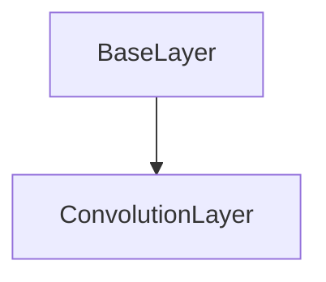

# ConvolutionLayer Class Documentation

[Return to `README`](/README.md)

The `ConvolutionLayer` class is a part of the `nn` namespace and is a template class that represents a convolutional layer in a neural network.

## References

- [`Shape`](/docs/core/shape.md)
- [`Tensor`](/docs/core/tensor.md)
- [`BaseLayer`](/docs/layer/base.md)
- [`NodeLayer`](/docs/layer/node.md)

## Diagram


## Inheritance



## Convolution Types

- `ConvolutionType::down_sample`: Down-sample convolution.
- `ConvolutionType::up_sample`: Up-sample convolution.

## Padding Types

- `PaddingType::zero`: Zero padding.
- `PaddingType::circular`: Circular padding.

## Padding Sizes

- `PaddingSize::valid`: Valid padding.
- `PaddingSize::same`: Same padding.
- `PaddingSize::full`: Full padding.
- `PaddingSize::custom`: Custom padding.

## Template Parameters

- `T`: The data type of the layer's parameters.
- `C`: The convolution type of the layer.
- `P`: The padding type of the layer.
- `S`: The padding size of the layer.

## Template

- `ConvolutionLayer<typename T, ConvolutionType C, PaddingType P, PaddingSize S>`

## Convolution Specializations

- `Convolution<T, ConvolutionType::down_sample, PaddingType::zero,      PaddingSize::valid>`
- `Convolution<T, ConvolutionType::down_sample, PaddingType::zero,      PaddingSize::same>`
- `Convolution<T, ConvolutionType::down_sample, PaddingType::zero,      PaddingSize::full>`
- `Convolution<T, ConvolutionType::down_sample, PaddingType::zero,      PaddingSize::custom>`
- `Convolution<T, ConvolutionType::down_sample, PaddingType::circular,  PaddingSize::valid>`
- `Convolution<T, ConvolutionType::down_sample, PaddingType::circular,  PaddingSize::same>`
- `Convolution<T, ConvolutionType::down_sample, PaddingType::circular,  PaddingSize::full>`
- `Convolution<T, ConvolutionType::down_sample, PaddingType::circular,  PaddingSize::custom>`
- `Convolution<T, ConvolutionType::up_sample,   PaddingType::zero,      PaddingSize::valid>`
- `Convolution<T, ConvolutionType::up_sample,   PaddingType::zero,      PaddingSize::same>`
- `Convolution<T, ConvolutionType::up_sample,   PaddingType::zero,      PaddingSize::full>`
- `Convolution<T, ConvolutionType::up_sample,   PaddingType::zero,      PaddingSize::custom>`
- `Convolution<T, ConvolutionType::up_sample,   PaddingType::circular,  PaddingSize::valid>`
- `Convolution<T, ConvolutionType::up_sample,   PaddingType::circular,  PaddingSize::same>`
- `Convolution<T, ConvolutionType::up_sample,   PaddingType::circular,  PaddingSize::full>`
- `Convolution<T, ConvolutionType::up_sample,   PaddingType::circular,  PaddingSize::custom`

## Members

- `static const ConvolutionType conv_type`: The convolution type of the layer.
- `static const PaddingType padding_type`: The padding type of the layer.
- `static const PaddingSize padding_size`: The padding size of the layer.

- `Shape<3> input_dilation`: The input dilation of the layer.
- `Shape<3> padding`: The padding of the layer.
- `Shape<3> inv_padding`: The inverse padding of the layer.
- `Shape<3> stride`: The stride of the layer.
- `Shape<3> dilation`: The dilation of the layer.
- `Tensor<T, 4> filter`: The filter tensor of the layer.
- `Tensor<T, 4> jacobian`: The jacobian tensor of the layer.
- `Tensor<T, 4> momentum`: The momentum tensor of the layer.
- `Tensor<T, 4> velocity`: The velocity tensor of the layer.

## Constructors

```
ConvolutionLayer(const Shape<4>& filter_shape = Shape<4>(0), const Shape<3>& stride = Shape<3>(0), const Shape<3>& dilation = Shape<3>(0), const T scalar = T()) requires ((C == ConvolutionType::down_sample) && (S != PaddingSize::custom))
```
- Constructs a `ConvolutionLayer` with a filter shape, stride, dilation, and scalar value.

```
ConvolutionLayer(const Shape<4>& filter_shape, const Shape<3>& stride, const Shape<3>& dilation, const std::vector<T> data) requires ((C == ConvolutionType::down_sample) && (S != PaddingSize::custom))
```
- Constructs a `ConvolutionLayer` with a filter shape, stride, dilation, and data vector.

```
ConvolutionLayer(const Shape<4>& filter_shape = Shape<4>(0), const Shape<3>& padding = Shape<3>(0), const Shape<3>& stride = Shape<3>(0), const Shape<3>& dilation = Shape<3>(0), const T scalar = T()) requires ((C == ConvolutionType::down_sample) && (S == PaddingSize::custom))
```
- Constructs a `ConvolutionLayer` with a filter shape, padding, stride, dilation, and scalar value.

```
ConvolutionLayer(const Shape<4>& filter_shape, const Shape<3>& padding, const Shape<3>& stride, const Shape<3>& dilation, const std::vector<T> data) requires ((C == ConvolutionType::down_sample) && (S == PaddingSize::custom))
```
- Constructs a `ConvolutionLayer` with a filter shape, padding, stride, dilation, and data vector.

```
ConvolutionLayer(const Shape<4>& filter_shape = Shape<4>(0), const Shape<3>& input_dilation = Shape<3>(0), const Shape<3>& stride = Shape<3>(0), const Shape<3>& dilation = Shape<3>(0), const T scalar = T()) requires ((C == ConvolutionType::up_sample) && (S != PaddingSize::custom))
```
- Constructs a `ConvolutionLayer` with a filter shape, input dilation, stride, dilation, and scalar value.

```
ConvolutionLayer(const Shape<4>& filter_shape, const Shape<3>& input_dilation, const Shape<3>& stride, const Shape<3>& dilation, const std::vector<T> data) requires ((C == ConvolutionType::up_sample) && (S != PaddingSize::custom))
```
- Constructs a `ConvolutionLayer` with a filter shape, input dilation, stride, dilation, and data vector.

```
ConvolutionLayer(const Shape<4>& filter_shape = Shape<4>(0), const Shape<3>& input_dilation = Shape<3>(0), const Shape<3>& padding = Shape<3>(0), const Shape<3>& stride = Shape<3>(0), const Shape<3>& dilation = Shape<3>(0), const T scalar = T()) requires ((C == ConvolutionType::up_sample) && (S == PaddingSize::custom))
```
- Constructs a `ConvolutionLayer` with a filter shape, input dilation, padding, stride, dilation, and scalar value.

```
ConvolutionLayer(const Shape<4>& filter_shape, const Shape<3>& input_dilation, const Shape<3>& padding, const Shape<3>& stride, const Shape<3>& dilation, const std::vector<T> data) requires ((C == ConvolutionType::up_sample) && (S == PaddingSize::custom))
```
- Constructs a `ConvolutionLayer` with a filter shape, input dilation, padding, stride, dilation, and data vector.

## Destructors

```
virtual ~ConvolutionLayer()
```
- Destructs a `ConvolutionLayer`.

## Methods

### Reshape
```
void reshape(const Shape<4>& shape)
```
- Reshapes the `ConvolutionLayer` with the specified shape.

### Resize
```
void resize(const Shape<4>& shape)
```
- Resizes the `ConvolutionLayer` with the specified shape.

### Calculate Output Shape
```
Shape<5> calculate_output_shape(const Shape<5>& input_shape) const requires (C == ConvolutionType::down_sample)
```
- Calculates the output shape of the `ConvolutionLayer` given the input shape.

```
Shape<5> calculate_output_shape(const Shape<5>& input_shape) const requires (C == ConvolutionType::up_sample)
```
- Calculates the output shape of the `ConvolutionLayer` given the input shape.

### Get Shape
```
const Shape<4>& get_shape() const
```
- Returns the shape of the `ConvolutionLayer`.

### Get Size
```
Size get_size() const
```
- Returns the size of the `ConvolutionLayer`.

### Get Filter
```
const Tensor<T, 4>& get_filter() const
```
- Returns the filter tensor of the `ConvolutionLayer`.

### Get Jacobian
```
const Tensor<T, 4>& get_jacobian() const
```
- Returns the jacobian tensor of the `ConvolutionLayer`.

### Get Momentum
```
const Tensor<T, 4>& get_momentum() const
```
- Returns the momentum tensor of the `ConvolutionLayer`.

### Get Velocity
```
const Tensor<T, 4>& get_velocity() const
```
- Returns the velocity tensor of the `ConvolutionLayer`.

### Get Stride
```
const Shape<3>& get_stride() const
```
- Returns the stride of the `ConvolutionLayer`.

### Get Padding
```
const Shape<3>& get_padding() const
```
- Returns the padding of the `ConvolutionLayer`.

### Get Dilation
```
const Shape<3>& get_dilation() const
```
- Returns the dilation of the `ConvolutionLayer`.

### Get Input Dilation
```
const Shape<3>& get_input_dilation() const
```
- Returns the input dilation of the `ConvolutionLayer`.

### Get Inverse Padding
```
const Shape<3>& get_inverse_padding() const
```
- Returns the inverse padding of the `ConvolutionLayer`.

### Set Training Mode
```
void set_training_mode(const TrainingMode training_mode)
```
- Sets the training mode of the `ConvolutionLayer`.

### Fill Filter
```
void fill_filter(const T value)
```
- Fills the filter tensor of the `ConvolutionLayer` with the specified value.

### Zero Filter
```
void zero_filter()
```
- Sets the filter tensor of the `ConvolutionLayer` to zero.

### Randomize Filter
```
void randomize_filter(const T min, const T max)
```
- Randomizes the filter tensor of the `ConvolutionLayer` within the specified range.

### Initialize
```
void initialize(const Shape<5>& input_layer_shape, const Shape<5>& output_layer_shape, const InitializationType initialization, const DistributionType distribution)
```
- Initializes the `ConvolutionLayer` with the specified input and output layer shapes, initialization type, and distribution type.

### Inference
```
template <typename U, typename V> Error inference(const NodeLayer<U>& input_layer, NodeLayer<V>& output_layer) const
```
- Performs inference on the `ConvolutionLayer` with the specified input and output layers.

### Backpropagation
```
template <typename U, typename V> Error backpropagation(NodeLayer<U>& input_layer, const NodeLayer<V>& output_layer)
```
- Performs backpropagation on the `ConvolutionLayer` with the specified input and output layers.

### Gradient Descent Normal
```
Error gradient_decent_normal(const Dim batch_size, const StepSize step_size)
```
- Performs gradient descent with normal update rule on the `ConvolutionLayer`.

### Gradient Descent Momentum
```
Error gradient_decent_momentum(const Dim batch_size, const StepSize step_size, const StepSize momentum_step_size)
```
- Performs gradient descent with momentum update rule on the `ConvolutionLayer`.

### Gradient Descent Adam
```
Error gradient_decent_adam(const Dim batch_size, const StepSize step_size, const Beta beta1, const Beta beta2, const Epsilon epsilon)
```
- Performs gradient descent with Adam update rule on the `ConvolutionLayer`.

## Operators

### Get Filter
```
inline T get_filter(const Dim4D& indices) const
```
- Returns the value of the filter at the specified coordinates.

### Get Jacobian
```
inline T get_jacobian(const Dim4D& indices) const
```
- Returns the value of the jacobian at the specified coordinates.

### Get Momentum
```
inline T get_momentum(const Dim4D& indices) const
```
- Returns the value of the momentum at the specified coordinates.

### Get Velocity
```
inline T get_velocity(const Dim4D& indices) const
```
- Returns the value of the velocity at the specified coordinates.

### Get Filter
```
inline T get_filter(const Idx index) const
```
- Returns the value of the filter at the specified index.

### Get Jacobian
```
inline T get_jacobian(const Idx index) const
```
- Returns the value of the jacobian at the specified index.

### Get Momentum
```
inline T get_momentum(const Idx index) const
```
- Returns the value of the momentum at the specified index.

### Get Velocity
```
inline T get_velocity(const Idx index) const
```
- Returns the value of the velocity at the specified index.

### Get Filter Reference
```
inline T& get_filter(const Dim4D& indices)
```
- Returns a reference to the filter at the specified coordinates.

### Get Filter Reference
```
inline T& get_filter(const Idx index)
```
- Returns a reference to the filter at the specified index.

### Get Jacobian Reference
```
inline T& get_jacobian(const Dim4D& indices)
```
- Returns a reference to the jacobian at the specified coordinates.

### Get Momentum Reference
```
inline T& get_momentum(const Dim4D& indices)
```
- Returns a reference to the momentum at the specified coordinates.

### Get Velocity Reference
```
inline T& get_velocity(const Dim4D& indices)
```
- Returns a reference to the velocity at the specified coordinates.

### Get Jacobian Reference
```
inline T& get_jacobian(const Idx index)
```
- Returns a reference to the jacobian at the specified index.

### Get Momentum Reference
```
inline T& get_momentum(const Idx index)
```
- Returns a reference to the momentum at the specified index.

### Get Velocity Reference
```
inline T& get_velocity(const Idx index)
```
- Returns a reference to the velocity at the specified index.

[Return to `README`](/README.md)