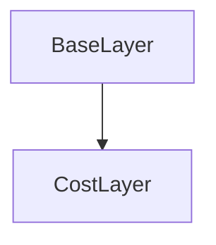

# CostLayer Class Documentation

[Return to `README`](/README.md)

The `CostLayer` class is a part of the `nn` namespace and is a template class that represents a layer with a cost function in a neural network.

## References

- [`Shape`](/docs/core/shape.md)
- [`Tensor`](/docs/core/tensor.md)
- [`BaseLayer`](/docs/layer/base.md)
- [`NodeLayer`](/docs/layer/node.md)

## Diagram


## Inheritance



## Cost Types

- `CostType::mean_squared_error`: The mean squared error cost function.
- `CostType::categorical_cross_entropy`: The categorical cross entropy cost function.
- `CostType::softmax_categorical_cross_entropy`: The softmax categorical cross entropy cost function.
- `CostType::hellinger_distance`: The Hellinger distance cost function.
- `CostType::kullback_leibler_divergence`: The Kullback-Leibler divergence cost function.
- `CostType::generalized_kullback_leibler_divergence`: The generalized Kullback-Leibler divergence cost function.
- `CostType::itakura_saito_distance`: The Itakura-Saito distance cost function.

## Template Parameters

- `C`: The cost type of the layer.

## Template

- `CostLayer<CostType C>`

## Cost Specializations

- `CostLayer<CostType::mean_squared_error>`
- `CostLayer<CostType::categorical_cross_entropy>`
- `CostLayer<CostType::softmax_categorical_cross_entropy>`
- `CostLayer<CostType::hellinger_distance>`
- `CostLayer<CostType::kullback_leibler_divergence>`
- `CostLayer<CostType::generalized_kullback_leibler_divergence>`
- `CostLayer<CostType::itakura_saito_distance>`

## Members

- `static const CostType type`: The cost type of the layer.
- `Dim num_examples`: The number of examples in the layer.

## Constructors

```
CostLayer(const Dim num_examples = 0)
```
- Constructs a `CostLayer` with the specified number of examples.

## Destructors

```
virtual ~CostLayer()
```
- Destructs a `CostLayer`.

## Methods

### Get Number of Examples
```
Dim get_num_examples() const
```
- Returns the number of examples in the `CostLayer`.

### Inference
```
template <typename U, typename V>
Error inference(NodeLayer<U>& layer, const NodeLayer<V>& target) const
```
- Performs inference on the `CostLayer` with the specified layer and target.

### Backpropagation
```
template <typename U, typename V>
Error backpropagation(NodeLayer<U>& layer, const NodeLayer<V>& target) const
```
- Performs backpropagation on the `CostLayer` with the specified layer and target.

## Operators

### Cost
```
template <typename U, typename V>
inline U cost(const V target, const U value) const requires (C == CostType::mean_squared_error)
```
- Calculates the cost between the target and value using the mean squared error cost function.

### Cost
```
template <typename U, typename V>
inline U cost(const V target, const U value) const requires (C == CostType::categorical_cross_entropy)
```
- Calculates the cost between the target and value using the categorical cross entropy cost function.

### Cost
```
template <typename U, typename V>
inline U cost(const V target, const U value) const requires (C == CostType::hellinger_distance)
```
- Calculates the cost between the target and value using the Hellinger distance cost function.

### Cost
```
template <typename U, typename V>
inline U cost(const V target, const U value) const requires (C == CostType::kullback_leibler_divergence)
```
- Calculates the cost between the target and value using the Kullback-Leibler divergence cost function.

### Cost
```
template <typename U, typename V>
inline U cost(const V target, const U value) const requires (C == CostType::generalized_kullback_leibler_divergence)
```
- Calculates the cost between the target and value using the generalized Kullback-Leibler divergence cost function.

### Cost
```
template <typename U, typename V>
inline U cost(const V target, const U value) const requires (C == CostType::itakura_saito_distance)
```
- Calculates the cost between the target and value using the Itakura-Saito distance cost function.

### Derivative of Cost
```
template <typename U, typename V>
inline U d_cost(const V target, const U value) const requires (C == CostType::mean_squared_error)
```
- Calculates the derivative of the cost between the target and value using the mean squared error cost function.

### Derivative of Cost
```
template <typename U, typename V>
inline U d_cost(const V target, const U value) const requires (C == CostType::categorical_cross_entropy)
```
- Calculates the derivative of the cost between the target and value using the categorical cross entropy cost function.

### Derivative of Cost
```
template <typename U, typename V>
inline U d_cost(const V target, const U value) const requires (C == CostType::hellinger_distance)
```
- Calculates the derivative of the cost between the target and value using the Hellinger distance cost function.

### Derivative of Cost
```
template <typename U, typename V>
inline U d_cost(const V target, const U value) const requires (C == CostType::kullback_leibler_divergence)
```
- Calculates the derivative of the cost between the target and value using the Kullback-Leibler divergence cost function.

### Derivative of Cost
```
template <typename U, typename V>
inline U d_cost(const V target, const U value) const requires (C == CostType::generalized_kullback_leibler_divergence)
```
- Calculates the derivative of the cost between the target and value using the generalized Kullback-Leibler divergence cost function.

### Derivative of Cost
```
template <typename U, typename V>
inline U d_cost(const V target, const U value) const requires (C == CostType::itakura_saito_distance)
```
- Calculates the derivative of the cost between the target and value using the Itakura-Saito distance cost function.

[Return to `README`](/README.md)