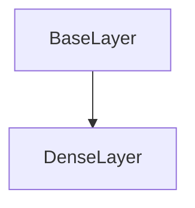

# DenseLayer Class Documentation

[Return to `README`](/README.md)

The `DenseLayer` class is a part of the `nn` namespace and is a template class that represents a dense layer in a neural network.

## References

- [`Shape`](/docs/core/shape.md)
- [`Tensor`](/docs/core/tensor.md)
- [`BaseLayer`](/docs/layer/base.md)
- [`NodeLayer`](/docs/layer/node.md)

## Diagram


## Inheritance



## Template Parameters

- `T`: The data type of the layer's parameters.

## Template

- `DenseLayer<typename T>`

## Members

- `Shape<5> input_shape`: The shape of the input to the layer.
- `Shape<5> output_shape`: The shape of the output from the layer.
- `Tensor<T, 2> weights`: The weights of the layer.
- `Tensor<T, 2> jacobian`: The jacobian of the layer.
- `Tensor<T, 2> momentum`: The momentum of the layer.
- `Tensor<T, 2> velocity`: The velocity of the layer.

## Constructors

```
DenseLayer(const Shape<5>& input_shape = Shape<5>(), const Shape<5>& output_shape = Shape<5>(), const T scalar = T())
```
- Constructs a `DenseLayer` with the specified input shape, output shape, and scalar value.

```
DenseLayer(const Shape<5>& input_shape, const Shape<5>& output_shape, const std::vector<T>& data)
```
- Constructs a `DenseLayer` with the specified input shape, output shape, and data.

## Destructors

```
virtual ~DenseLayer()
```
- Destructs a `DenseLayer`.

## Methods

### Reshape
```
void reshape(const Shape<5>& input_shape, const Shape<5>& output_shape)
```
- Reshapes the `DenseLayer` with the specified input shape and output shape.

### Resize
```
void resize(const Shape<5>& input_shape, const Shape<5>& output_shape)
```
- Resizes the `DenseLayer` with the specified input shape and output shape.

### Set Training Mode
```
void set_training_mode(const TrainingMode training_mode)
```
- Sets the training mode of the `DenseLayer`.

### Get Shape
```
const Shape<2>& get_shape() const
```
- Returns the shape of the `DenseLayer`.

### Get Size
```
Size get_size() const
```
- Returns the size of the `DenseLayer`.

### Get Input Shape
```
const Shape<5>& get_input_shape() const
```
- Returns the input shape of the `DenseLayer`.

### Get Output Shape
```
const Shape<5>& get_output_shape() const
```
- Returns the output shape of the `DenseLayer`.

### Get Weights
```
const Tensor<T, 2>& get_weights() const
```
- Returns the weights tensor of the `DenseLayer`.

### Get Jacobian
```
const Tensor<T, 2>& get_jacobian() const
```
- Returns the jacobian tensor of the `DenseLayer`.

### Get Momentum
```
const Tensor<T, 2>& get_momentum() const
```
- Returns the momentum tensor of the `DenseLayer`.

### Get Velocity
```
const Tensor<T, 2>& get_velocity() const
```
- Returns the velocity tensor of the `DenseLayer`.

### Fill Weights
```
void fill_weights(const T value)
```
- Fills the weights tensor of the `DenseLayer` with the specified value.

### Zero Weights
```
void zero_weights()
```
- Sets all weights of the `DenseLayer` to zero.

### Randomize Weights
```
void randomize_weights(const T min, const T max)
```
- Randomizes all weights of the `DenseLayer` within the specified range.

### Initialize Weights
```
void initialize_weights(const InitializationType type, const DistributionType distribution)
```
- Initializes all weights of the `DenseLayer` using the specified initialization type and distribution.

### Fill Jacobian
```
void fill_jacobian(const T value)
```
- Fills the jacobian tensor of the `DenseLayer` with the specified value.

### Fill Momentum
```
void fill_momentum(const T value)
```
- Fills the momentum tensor of the `DenseLayer` with the specified value.

### Fill Velocity
```
void fill_velocity(const T value)
```
- Fills the velocity tensor of the `DenseLayer` with the specified value.

### Zero Jacobian
```
void zero_jacobian()
```
- Sets all values in the jacobian tensor of the `DenseLayer` to zero.

### Zero Momentum
```
void zero_momentum()
```
- Sets all values in the momentum tensor of the `DenseLayer` to zero.

### Zero Velocity
```
void zero_velocity()
```
- Sets all values in the velocity tensor of the `DenseLayer` to zero.

### Randomize Jacobian
```
void randomize_jacobian(const T min, const T max)
```
- Randomizes all values in the jacobian tensor of the `DenseLayer` within the specified range.

### Randomize Momentum
```
void randomize_momentum(const T min, const T max)
```
- Randomizes all values in the momentum tensor of the `DenseLayer` within the specified range.

### Randomize Velocity
```
void randomize_velocity(const T min, const T max)
```
- Randomizes all values in the velocity tensor of the `DenseLayer` within the specified range.

### Inference
```
template <typename U, typename V> Error inference(const NodeLayer<U>& input_layer, NodeLayer<V>& output_layer) const
```
- Performs inference on the `DenseLayer` with the specified input layer and output layer.

### Backpropagation
```
template <typename U, typename V> Error backpropagation(NodeLayer<U>& input_layer, const NodeLayer<V>& output_layer)
```
- Performs backpropagation on the `DenseLayer` with the specified input layer and output layer.

### Gradient Descent Normal
```
Error gradient_decent_normal(const Dim batch_size, const StepSize step_size)
```
- Performs gradient descent with normal update rule on the `DenseLayer`.

### Gradient Descent Momentum
```
Error gradient_decent_momentum(const Dim batch_size, const StepSize step_size, const StepSize momentum_step_size)
```
- Performs gradient descent with momentum update rule on the `DenseLayer`.

### Gradient Descent Adam
```
Error gradient_decent_adam(const Dim batch_size, const StepSize step_size, const Beta beta1, const Beta beta2, const Epsilon epsilon)
```
- Performs gradient descent with Adam update rule on the `DenseLayer`.

## Operators

### Get Weight
```
inline T get_weight(const Dim2D& indices) const
```
- Returns the value of the weight at the specified coordinates.

### Get Weight
```
inline T& get_weight(const Dim2D& indices)
```
- Returns a reference to the weight at the specified coordinates.

### Get Weight
```
inline T get_weight(const Idx index) const
```
- Returns the value of the weight at the specified index.

### Get Weight
```
inline T& get_weight(const Idx index)
```
- Returns a reference to the weight at the specified index.

### Get Jacobian
```
inline T get_jacobian(const Dim2D& indices) const
```
- Returns the value of the jacobian at the specified coordinates.

### Get Jacobian
```
inline T get_jacobian(const Idx index) const
```
- Returns the value of the jacobian at the specified index.

### Get Momentum
```
inline T get_momentum(const Dim2D& indices) const
```
- Returns the value of the momentum at the specified coordinates.

### Get Momentum
```
inline T get_momentum(const Idx index) const
```
- Returns the value of the momentum at the specified index.

### Get Velocity
```
inline T get_velocity(const Dim2D& indices) const
```
- Returns the value of the velocity at the specified coordinates.

### Get Velocity
```
inline T get_velocity(const Idx index) const
```
- Returns the value of the velocity at the specified index.

### Get Jacobian Reference
```
inline T& get_jacobian(const Dim2D& indices)
```
- Returns a reference to the jacobian at the specified coordinates.

### Get Momentum Reference
```
inline T& get_momentum(const Dim2D& indices)
```
- Returns a reference to the momentum at the specified coordinates.

### Get Velocity Reference
```
inline T& get_velocity(const Dim2D& indices)
```
- Returns a reference to the velocity at the specified coordinates.

### Get Jacobian Reference
```
inline T& get_jacobian(const Idx index)
```
- Returns a reference to the jacobian at the specified index.

### Get Momentum Reference
```
inline T& get_momentum(const Idx index)
```
- Returns a reference to the momentum at the specified index.

### Get Velocity Reference
```
inline T& get_velocity(const Idx index)
```
- Returns a reference to the velocity at the specified index.

### Operator +
```
inline DenseLayer<T> operator+(const DenseLayer& other) const
```
- Returns a new `DenseLayer` that is the sum of this `DenseLayer` and another `DenseLayer`.

### Operator -
```
inline DenseLayer<T> operator-(const DenseLayer& other) const
```
- Returns a new `DenseLayer` that is the difference between this `DenseLayer` and another `DenseLayer`.

### Operator *
```
inline DenseLayer<T> operator*(const DenseLayer& other) const
```
- Returns a new `DenseLayer` that is the element-wise product of this `DenseLayer` and another `DenseLayer`.

### Operator /
```
inline DenseLayer<T> operator/(const DenseLayer& other) const
```
- Returns a new `DenseLayer` that is the element-wise division of this `DenseLayer` by another `DenseLayer`.

### Operator +=
```
inline DenseLayer<T>& operator+=(const DenseLayer& other)
```
- Adds another `DenseLayer` to this `DenseLayer` and assigns the result to this `DenseLayer`.

### Operator -=
```
inline DenseLayer<T>& operator-=(const DenseLayer& other)
```
- Subtracts another `DenseLayer` from this `DenseLayer` and assigns the result to this `DenseLayer`.

### Operator *=
```
inline DenseLayer<T>& operator*=(const DenseLayer& other)
```
- Multiplies this `DenseLayer` by another `DenseLayer` element-wise and assigns the result to this `DenseLayer`.

### Operator /=
```
inline DenseLayer<T>& operator/=(const DenseLayer& other)
```
- Divides this `DenseLayer` by another `DenseLayer` element-wise and assigns the result to this `DenseLayer`.

### Operator +
```
inline DenseLayer<T> operator+(const T scalar) const
```
- Returns a new `DenseLayer` that is the sum of this `DenseLayer` and a scalar value.

### Operator -
```
inline DenseLayer<T> operator-(const T scalar) const
```
- Returns a new `DenseLayer` that is the difference between this `DenseLayer` and a scalar value.

### Operator *
```
inline DenseLayer<T> operator*(const T scalar) const
```
- Returns a new `DenseLayer` that is the product of this `DenseLayer` and a scalar value.

### Operator /
```
inline DenseLayer<T> operator/(const T scalar) const
```
- Returns a new `DenseLayer` that is the division of this `DenseLayer` by a scalar value.

### Operator +=
```
inline DenseLayer<T>& operator+=(const T scalar)
```
- Adds a scalar value to this `DenseLayer` and assigns the result to this `DenseLayer`.

### Operator -=
```
inline DenseLayer<T>& operator-=(const T scalar)
```
- Subtracts a scalar value from this `DenseLayer` and assigns the result to this `DenseLayer`.

### Operator *=
```
inline DenseLayer<T>& operator*=(const T scalar)
```
- Multiplies this `DenseLayer` by a scalar value and assigns the result to this `DenseLayer`.

### Operator /=
```
inline DenseLayer<T>& operator/=(const T scalar)
```
- Divides this `DenseLayer` by a scalar value and assigns the result to this `DenseLayer`.

[Return to `README`](/README.md)