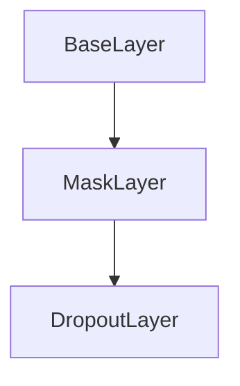

# DropoutLayer Class Documentation

[Return to `README`](/README.md)

The `DropoutLayer` class is a part of the `nn` namespace and is a subclass of the `MaskLayer` class. It represents a layer in a neural network that applies dropout regularization.

## References

- [`Shape`](/docs/core/shape.md)
- [`BaseLayer`](/docs/layer/base.md)
- [`NodeLayer`](/docs/layer/node.md)
- [`MaskLayer`](/docs/layer/mask.md)

## Diagram


## Inheritance



## Members

- `double rate`: The dropout rate of the layer.

## Constructors

```
DropoutLayer( const Shape<4>& shape = Shape<4>(), const double dropout_rate = 0 )
```
- Constructs a `DropoutLayer` with the specified shape and dropout rate.

## Destructors

```
virtual ~DropoutLayer()
```
- Destructs a `DropoutLayer`.

## Methods

### Reshape
```
void reshape( const Shape<4>& shape )
```
- Reshapes the `DropoutLayer` to the specified shape.

### Resize
```
void resize( const Shape<4>& shape )
```
- Resizes the `DropoutLayer` to the specified shape.

### Get Shape
```
const Shape<4>& get_shape() const
```
- Returns the shape of the `DropoutLayer`.

### Get Size
```
Size get_size() const
```
- Returns the size of the `DropoutLayer`.

### Get Rate
```
double get_rate() const
```
- Returns the dropout rate of the `DropoutLayer`.

### Inference
```
template <typename U> Error inference( NodeLayer<U>& layer )
```
- Performs inference on the `DropoutLayer`.

### Backpropagation
```
template <typename U> Error backpropagation( NodeLayer<U>& layer ) const
```
- Performs backpropagation on the `DropoutLayer`.

[Return to `README`](/README.md)