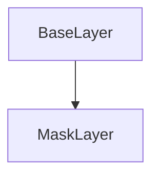

# MaskLayer Class Documentation

[Return to `README`](/README.md)

The `MaskLayer` class is a part of the `nn` namespace and represents a layer that applies a mask to the input data in a neural network.

## References

- [`Shape`](/docs/core/shape.md)
- [`Tensor`](/docs/core/tensor.md)
- [`BaseLayer`](/docs/layer/base.md)
- [`NodeLayer`](/docs/layer/node.md)

## Inheritance



## Members

- `Tensor<bool, 4> mask`: The mask tensor that is applied to the input data.

## Constructors

```
MaskLayer(const Shape<4>& shape = Shape<4>(), const bool scalar = false)
```
- Constructs a `MaskLayer` with the specified shape and scalar flag.

```
MaskLayer(const LayerType type = LayerType::mask_layer, const Shape<4>& shape = Shape<4>(), const bool scalar = false)
```
- Constructs a `MaskLayer` with the specified type, shape, and scalar flag.

## Destructors

```
virtual ~MaskLayer()
```
- Destructs a `MaskLayer`.

## Methods

### Reshape
```
void reshape(const Shape<4>& shape)
```
- Reshapes the `MaskLayer` with the specified shape.

### Resize
```
void resize(const Shape<4>& shape)
```
- Resizes the `MaskLayer` with the specified shape.

### Get Shape
```
const Shape<4>& get_shape() const
```
- Returns the shape of the `MaskLayer`.

### Get Size
```
Size get_size() const
```
- Returns the size of the `MaskLayer`.

### Get Mask
```
const Tensor<bool, 4>& get_mask() const
```
- Returns the mask tensor of the `MaskLayer`.

### Fill
```
void fill(const bool value)
```
- Fills the mask tensor of the `MaskLayer` with the specified value.

### Inference
```
template <typename U> Error inference(NodeLayer<U>& layer) const
```
- Performs inference on the `MaskLayer`.

### Backpropagation
```
template <typename U> Error backpropagation(NodeLayer<U>& layer) const
```
- Performs backpropagation on the `MaskLayer`.

## Operators

### Get Mask
```
inline bool get_mask(const Dim4D& indices) const
```
- Returns the value of the mask at the specified coordinates.

### Get Mask
```
inline bool get_mask(const Idx index) const
```
- Returns the value of the mask at the specified index.

### Get Mask Reference
```
inline bool& get_mask(const Dim4D& indices)
```
- Returns a reference to the mask at the specified coordinates.

### Get Mask Reference
```
inline bool& get_mask(const Idx index)
```
- Returns a reference to the mask at the specified index.

[Return to `README`](/README.md)