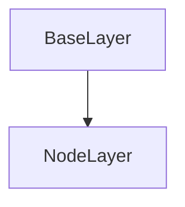

# NodeLayer Class Documentation

[Return to `README`](/README.md)

The `NodeLayer` class is a part of the `nn` namespace and is a template class that inherits from the `BaseLayer` class. It is used to represent a layer of nodes in a neural network.

## References

- [`Shape`](/docs/core/shape.md)
- [`Tensor`](/docs/core/tensor.md)
- [`BaseLayer`](/docs/layer/base.md)

## Inheritance



## Template Parameters

- `T`: The data type of the layer's parameters.

## Members

- `Tensor<T, 5> nodes`: A 5-dimensional tensor representing the layer's nodes.
- `Tensor<T, 5> delta`: A 5-dimensional tensor representing the layer's delta.

## Constructors
```
NodeLayer( const Shape<5>& shape, const T scalar )
```
Where `default: shape = Shape<5>()` & `default: scalar = T()`
- Constructs a `NodeLayer` with the specified shape from a scalar.

```
NodeLayer( const Shape<5>& shape, const std::vector<T>& data )
```
Where `shape is required` & `data is required`
- Constructs a `NodeLayer` with the specified shape from a vector.

## Destructors

```
~NodeLayer()
```
- Destructs a `NodeLayer`.

## Methods

### Reshape:
```
void reshape( const Shape<5>& shape )
```
- Reshapes the `NodeLayer`.

### Resize:
```
void resize( const Shape<5>& shape )
```
- Resizes the `NodeLayer`.

### Set Training Mode:
```
void set_training_mode( const TrainingMode training_mode )
```
- Sets the `NodeLayer`'s training mode.

### Get Shape:
```
const Shape<5>& get_shape() const
```
- Returns the shape of the `NodeLayer`.

### Get Size:
```
Size get_size() const
```
- Returns the size of the `NodeLayer`.

### Get Nodes:
```
const Tensor<T, 5>& get_nodes() const
```
- Returns the `NodeLayer`'s node tensor.

### Get Delta:
```
const Tensor<T, 5>& get_delta() const
```
- Returns the `NodeLayer`'s delta tensor.

### Fill Nodes:
```
void fill_nodes( const T value )
```
- Fills the nodes of the `NodeLayer` with the specified value.

### Zero Nodes
```
void zero_nodes()
```
- Sets all nodes of the `NodeLayer` to zero.

### Randomize Nodes:
```
void randomize_nodes( const T min, const T max )
```
- Randomizes the nodes of the `NodeLayer` within the specified range.

## Operators

### Get Node 5D Index
```
inline T get_node( const Dim5D& indices ) const;
```
- Returns the value of the node at the specified coordinates.

### Get Delta 5D Index
```
inline T get_delta( const Dim5D& indices ) const;
```
- Returns the value of the delta at the specified coordinates.

### Get Node Linear Index
```
inline T get_node( const Idx index ) const;
```
- Returns the value of the node at the specified index.

### Get Delta Linear Index
```
inline T get_delta( const Idx index ) const;
```
- Returns the value of the delta at the specified index.

### Get Node Reference 5D Index
```
inline T& get_node( const Dim5D& indices );
```
- Returns a reference to the node at the specified coordinates.

### Get Delta Reference 5D Index
```
inline T& get_delta( const Dim5D& indices );
```
- Returns a reference to the delta at the specified coordinates.

### Get Node Reference Linear Index
```
inline T& get_node( const Idx index );
```
- Returns a reference to the node at the specified index.

### Get Delta Reference Linear Index
```
inline T& get_delta( const Idx index );
```
- Returns a reference to the delta at the specified index.

### Assign
```
inline NodeLayer<T> operator=( const NodeLayer<T>& other ) const;
```
- Assigns the value of `other` to the current `NodeLayer`.

### Add
```
inline NodeLayer<T> operator+( const NodeLayer<T>& other ) const;
```
- Returns a new `NodeLayer` that is the result of element-wise addition of the current `NodeLayer` and `other`.

### Subtract
```
inline NodeLayer<T> operator-( const NodeLayer<T>& other ) const;
```
- Returns a new `NodeLayer` that is the result of element-wise subtraction of `other` from the current `NodeLayer`.

### Multiply
```
inline NodeLayer<T> operator*( const NodeLayer<T>& other ) const;
```
- Returns a new `NodeLayer` that is the result of element-wise multiplication of the current `NodeLayer` and `other`.

### Divide
```
inline NodeLayer<T> operator/( const NodeLayer<T>& other ) const;
```
- Returns a new `NodeLayer` that is the result of element-wise division of the current `NodeLayer` by `other`.

### Add Assign
```
inline NodeLayer<T>& operator+=( const NodeLayer<T>& other );
```
- Performs an element-wise addition of `other` to the current `NodeLayer` and assigns the result to the current `NodeLayer`.

### Subtract Assign
```
inline NodeLayer<T>& operator-=( const NodeLayer<T>& other );
```
- Performs an element-wise subtraction of `other` from the current `NodeLayer` and assigns the result to the current `NodeLayer`.

### Multiply Assign
```
inline NodeLayer<T>& operator*=( const NodeLayer<T>& other );
```
- Performs an element-wise multiplication of the current `NodeLayer` and `other` and assigns the result to the current `NodeLayer`.

### Divide Assign
```
inline NodeLayer<T>& operator/=( const NodeLayer<T>& other );
```
- Performs an element-wise division of the current `NodeLayer` by `other` and assigns the result to the current `NodeLayer`.

### Scalar Addition
```
inline NodeLayer<T> operator+( const T scalar ) const;
```
- Returns a new `NodeLayer` that is the result of adding `scalar` to each element of the current `NodeLayer`.

### Scalar Subtraction
```
inline NodeLayer<T> operator-( const T scalar ) const;
```
- Returns a new `NodeLayer` that is the result of subtracting `scalar` from each element of the current `NodeLayer`.

### Scalar Multiplication
```
inline NodeLayer<T> operator*( const T scalar ) const;
```
- Returns a new `NodeLayer` that is the result of multiplying each element of the current `NodeLayer` by `scalar`.

### Scalar Division
```
inline NodeLayer<T> operator/( const T scalar ) const;
```
- Returns a new `NodeLayer` that is the result of dividing each element of the current `NodeLayer` by `scalar`.

### Scalar Addition Assign
```
inline NodeLayer<T>& operator+=( const T scalar );
```
- Adds `scalar` to each element of the current `NodeLayer` and assigns the result to the current `NodeLayer`.

### Scalar Subtraction Assign
```
inline NodeLayer<T>& operator-=( const T scalar );
```
- Subtracts `scalar` from each element of the current `NodeLayer` and assigns the result to the current `NodeLayer`.

### Scalar Multiplication Assign
```
inline NodeLayer<T>& operator*=( const T scalar );
```
- Multiplies each element of the current `NodeLayer` by `scalar` and assigns the result to the current `NodeLayer`.

### Scalar Division Assign
```
inline NodeLayer<T>& operator/=( const T scalar );
```
- Divides each element of the current `NodeLayer` by `scalar` and assigns the result to the current `NodeLayer`.

[Return to `README`](/README.md)