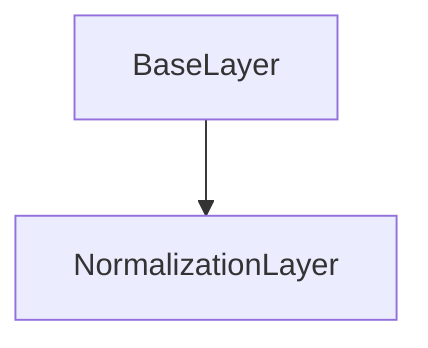

# NormalizationLayer Class Documentation

[Return to `README`](/README.md)

The `NormalizationLayer` class is a part of the `nn` namespace and is a template class that represents a layer with normalization in a neural network.

## References

- [`Shape`](/docs/core/shape.md)
- [`Tensor`](/docs/core/tensor.md)
- [`BaseLayer`](/docs/layer/base.md)
- [`NodeLayer`](/docs/layer/node.md)

## Diagram


## Inheritance



## Normalization Types

- `NormalizationType::batch_wise`: The batch-wise normalization type.
- `NormalizationType::layer_wise`: The layer-wise normalization type.
- `NormalizationType::instance_wise`: The instance-wise normalization type.
- `NormalizationType::group_wise`: The group-wise normalization type.

## Template Parameters

- `T`: The data type of the layer's parameters.
- `N`: The normalization type of the layer.

## Template

- `NormalizationLayer<typename T, NormalizationType N>`

## Normalization Specializations

- `NormalizationLayer<T, NormalizationType::batch_wise>`
- `NormalizationLayer<T, NormalizationType::layer_wise>`
- `NormalizationLayer<T, NormalizationType::instance_wise>`
- `NormalizationLayer<T, NormalizationType::group_wise>`

## Members

- `static const NormalizationType type`: The normalization type of the layer.
- `static const u8 dim`: The dimension of the layer's tensors.

- `Tensor<T, dim> mean`: The mean tensor of the layer.
- `Tensor<T, dim> variance`: The variance tensor of the layer.
- `Tensor<T, dim> beta`: The offset parameter tensor of the layer.
- `Tensor<T, dim> gamma`: The scaling parameter tensor of the layer.
- `Tensor<T, dim> beta_jacobian`: The offset parameter jacobian tensor of the layer.
- `Tensor<T, dim> gamma_jacobian`: The scaling parameter jacobian tensor of the layer.
- `Tensor<T, dim> beta_momentum`: The offset parameter momentum tensor of the layer.
- `Tensor<T, dim> gamma_momentum`: The scaling parameter momentum tensor of the layer.
- `Tensor<T, dim> beta_velocity`: The offset parameter velocity tensor of the layer.
- `Tensor<T, dim> gamma_velocity`: The scaling parameter velocity tensor of the layer.

## Constructors

```
NormalizationLayer(const u8 channels = 0) requires (N == NormalizationType::batch_wise)
```
- Constructs a `NormalizationLayer` with batch-wise normalization.

```
NormalizationLayer(const u8 batches = 0) requires (N == NormalizationType::layer_wise)
```
- Constructs a `NormalizationLayer` with layer-wise normalization.

```
NormalizationLayer(const u8 channels = 0, const u8 batches = 0) requires (N == NormalizationType::instance_wise)
```
- Constructs a `NormalizationLayer` with instance-wise normalization.

```
NormalizationLayer(const u8 channels = 0, const u8 batches = 0, const u8 group_size = 0) requires (N == NormalizationType::group_wise)
```
- Constructs a `NormalizationLayer` with group-wise normalization.

## Destructors

```
virtual ~NormalizationLayer()
```
- Destructs a `NormalizationLayer`.

## Methods

### Get Shape
```
const Shape<4>& get_shape() const requires (N == NormalizationType::batch_wise)
```
- Returns the shape of the `NormalizationLayer` for batch-wise normalization.

```
const Shape<5>& get_shape() const requires (N == NormalizationType::layer_wise || N == NormalizationType::instance_wise || N == NormalizationType::group_wise)
```
- Returns the shape of the `NormalizationLayer` for layer-wise, instance-wise, or group-wise normalization.

### Get Size
```
Size get_size() const
```
- Returns the size of the `NormalizationLayer`.

### Get Mean
```
const Tensor<T, 4>& get_mean() const requires (N == NormalizationType::batch_wise)
```
- Returns the mean tensor of the `NormalizationLayer` for batch-wise normalization.

```
const Tensor<T, 5>& get_mean() const requires (N == NormalizationType::layer_wise || N == NormalizationType::instance_wise || N == NormalizationType::group_wise)
```
- Returns the mean tensor of the `NormalizationLayer` for layer-wise, instance-wise, or group-wise normalization.

### Get Variance
```
const Tensor<T, 4>& get_variance() const requires (N == NormalizationType::batch_wise)
```
- Returns the variance tensor of the `NormalizationLayer` for batch-wise normalization.

```
const Tensor<T, 5>& get_variance() const requires (N == NormalizationType::layer_wise || N == NormalizationType::instance_wise || N == NormalizationType::group_wise)
```
- Returns the variance tensor of the `NormalizationLayer` for layer-wise, instance-wise, or group-wise normalization.

### Get Beta
```
const Tensor<T, 4>& get_beta() const requires (N == NormalizationType::batch_wise)
```
- Returns the offset parameter tensor of the `NormalizationLayer` for batch-wise normalization.

```
const Tensor<T, 5>& get_beta() const requires (N == NormalizationType::layer_wise || N == NormalizationType::instance_wise || N == NormalizationType::group_wise)
```
- Returns the offset parameter tensor of the `NormalizationLayer` for layer-wise, instance-wise, or group-wise normalization.

### Get Gamma
```
const Tensor<T, 4>& get_gamma() const requires (N == NormalizationType::batch_wise)
```
- Returns the scaling parameter tensor of the `NormalizationLayer` for batch-wise normalization.

```
const Tensor<T, 5>& get_gamma() const requires (N == NormalizationType::layer_wise || N == NormalizationType::instance_wise || N == NormalizationType::group_wise)
```
- Returns the scaling parameter tensor of the `NormalizationLayer` for layer-wise, instance-wise, or group-wise normalization.

### Get Beta Jacobian
```
const Tensor<T, 4>& get_beta_jacobian() const requires (N == NormalizationType::batch_wise)
```
- Returns the offset parameter jacobian tensor of the `NormalizationLayer` for batch-wise normalization.

```
const Tensor<T, 5>& get_beta_jacobian() const requires (N == NormalizationType::layer_wise || N == NormalizationType::instance_wise || N == NormalizationType::group_wise)
```
- Returns the offset parameter jacobian tensor of the `NormalizationLayer` for layer-wise, instance-wise, or group-wise normalization.

### Get Gamma Jacobian
```
const Tensor<T, 4>& get_gamma_jacobian() const requires (N == NormalizationType::batch_wise)
```
- Returns the scaling parameter jacobian tensor of the `NormalizationLayer` for batch-wise normalization.

```
const Tensor<T, 5>& get_gamma_jacobian() const requires (N == NormalizationType::layer_wise || N == NormalizationType::instance_wise || N == NormalizationType::group_wise)
```
- Returns the scaling parameter jacobian tensor of the `NormalizationLayer` for layer-wise, instance-wise, or group-wise normalization.

### Get Beta Momentum
```
const Tensor<T, 4>& get_beta_momentum() const requires (N == NormalizationType::batch_wise)
```
- Returns the offset parameter momentum tensor of the `NormalizationLayer` for batch-wise normalization.

```
const Tensor<T, 5>& get_beta_momentum() const requires (N == NormalizationType::layer_wise || N == NormalizationType::instance_wise || N == NormalizationType::group_wise)
```
- Returns the offset parameter momentum tensor of the `NormalizationLayer` for layer-wise, instance-wise, or group-wise normalization.

### Get Gamma Momentum
```
const Tensor<T, 4>& get_gamma_momentum() const requires (N == NormalizationType::batch_wise)
```
- Returns the scaling parameter momentum tensor of the `NormalizationLayer` for batch-wise normalization.

```
const Tensor<T, 5>& get_gamma_momentum() const requires (N == NormalizationType::layer_wise || N == NormalizationType::instance_wise || N == NormalizationType::group_wise)
```
- Returns the scaling parameter momentum tensor of the `NormalizationLayer` for layer-wise, instance-wise, or group-wise normalization.

### Get Beta Velocity
```
const Tensor<T, 4>& get_beta_velocity() const requires (N == NormalizationType::batch_wise)
```
- Returns the offset parameter velocity tensor of the `NormalizationLayer` for batch-wise normalization.

```
const Tensor<T, 5>& get_beta_velocity() const requires (N == NormalizationType::layer_wise || N == NormalizationType::instance_wise || N == NormalizationType::group_wise)
```
- Returns the offset parameter velocity tensor of the `NormalizationLayer` for layer-wise, instance-wise, or group-wise normalization.

### Get Gamma Velocity
```
const Tensor<T, 4>& get_gamma_velocity() const requires (N == NormalizationType::batch_wise)
```
- Returns the scaling parameter velocity tensor of the `NormalizationLayer` for batch-wise normalization.

```
const Tensor<T, 5>& get_gamma_velocity() const requires (N == NormalizationType::layer_wise || N == NormalizationType::instance_wise || N == NormalizationType::group_wise)
```
- Returns the scaling parameter velocity tensor of the `NormalizationLayer` for layer-wise, instance-wise, or group-wise normalization.

### Reshape
```
void reshape(const u8 channels) requires (N == NormalizationType::batch_wise)
```
- Reshapes the `NormalizationLayer` for batch-wise normalization.

```
void reshape(const u8 batches) requires (N == NormalizationType::layer_wise)
```
- Reshapes the `NormalizationLayer` for layer-wise normalization.

```
void reshape(const u8 channels, const u8 batches) requires (N == NormalizationType::instance_wise)
```
- Reshapes the `NormalizationLayer` for instance-wise normalization.

```
void reshape(const u8 channels, const u8 batches, const u8 group_size) requires (N == NormalizationType::group_wise)
```
- Reshapes the `NormalizationLayer` for group-wise normalization.

### Resize
```
void resize(const u8 channels) requires (N == NormalizationType::batch_wise)
```
- Resizes the `NormalizationLayer` for batch-wise normalization.

```
void resize(const u8 batches) requires (N == NormalizationType::layer_wise)
```
- Resizes the `NormalizationLayer` for layer-wise normalization.

```
void resize(const u8 channels, const u8 batches) requires (N == NormalizationType::instance_wise)
```
- Resizes the `NormalizationLayer` for instance-wise normalization.

```
void resize(const u8 channels, const u8 batches, const u8 group_size) requires (N == NormalizationType::group_wise)
```
- Resizes the `NormalizationLayer` for group-wise normalization.

### Set Training Mode
```
void set_training_mode(TrainingMode training_mode) requires (N == NormalizationType::batch_wise || N == NormalizationType::layer_wise || N == NormalizationType::instance_wise || N == NormalizationType::group_wise)
```
- Sets the training mode of the `NormalizationLayer`.

### Stat Analysis
```
template <typename U> Error stat_analysis(const NodeLayer<U>& layer) requires (N == NormalizationType::batch_wise)
```
- Performs statistical analysis on the `NormalizationLayer` for batch-wise normalization.

```
template <typename U> Error stat_analysis(const NodeLayer<U>& layer) requires (N == NormalizationType::layer_wise)
```
- Performs statistical analysis on the `NormalizationLayer` for layer-wise normalization.

```
template <typename U> Error stat_analysis(const NodeLayer<U>& layer) requires (N == NormalizationType::instance_wise)
```
- Performs statistical analysis on the `NormalizationLayer` for instance-wise normalization.

```
template <typename U> Error stat_analysis(const NodeLayer<U>& layer) requires (N == NormalizationType::group_wise)
```
- Performs statistical analysis on the `NormalizationLayer` for group-wise normalization.

### Inference
```
template <typename U> Error inference(NodeLayer<U>& layer) const requires (N == NormalizationType::batch_wise || N == NormalizationType::layer_wise || N == NormalizationType::instance_wise || N == NormalizationType::group_wise)
```
- Performs inference on the `NormalizationLayer`.

### Backpropagation
```
template <typename U> Error backpropagation(NodeLayer<U>& layer) requires (N == NormalizationType::batch_wise || N == NormalizationType::layer_wise || N == NormalizationType::instance_wise || N == NormalizationType::group_wise)
```
- Performs backpropagation on the `NormalizationLayer`.

### Gradient Descent Normal
```
Error gradient_decent_normal(const Dim batch_size, const StepSize step_size)
```
- Performs gradient descent with normal update rule on the `NormalizationLayer`.

### Gradient Descent Momentum
```
Error gradient_decent_momentum(const Dim batch_size, const StepSize step_size, const StepSize momentum_step_size)
```
- Performs gradient descent with momentum update rule on the `NormalizationLayer`.

### Gradient Descent Adam
```
Error gradient_decent_adam(const Dim batch_size, const StepSize step_size, const Beta beta1, const Beta beta2, const Epsilon epsilon)
```
- Performs gradient descent with Adam update rule on the `NormalizationLayer`.

## Operators

### Get Mean
```
inline T get_mean(const Dim4D& indices) const requires (N == NormalizationType::batch_wise)
```
- Returns the value of the mean at the specified coordinates for batch-wise normalization.

```
inline T get_mean(const Dim5D& indices) const requires (N == NormalizationType::layer_wise || N == NormalizationType::instance_wise || N == NormalizationType::group_wise)
```
- Returns the value of the mean at the specified coordinates for layer-wise, instance-wise, or group-wise normalization.

### Get Variance
```
inline T get_variance(const Dim4D& indices) const requires (N == NormalizationType::batch_wise)
```
- Returns the value of the variance at the specified coordinates for batch-wise normalization.

```
inline T get_variance(const Dim5D& indices) const requires (N == NormalizationType::layer_wise || N == NormalizationType::instance_wise || N == NormalizationType::group_wise)
```
- Returns the value of the variance at the specified coordinates for layer-wise, instance-wise, or group-wise normalization.

### Get Beta
```
inline T get_beta(const Dim4D& indices) const requires (N == NormalizationType::batch_wise)
```
- Returns the value of the offset parameter at the specified coordinates for batch-wise normalization.

```
inline T get_beta(const Dim5D& indices) const requires (N == NormalizationType::layer_wise || N == NormalizationType::instance_wise || N == NormalizationType::group_wise)
```
- Returns the value of the offset parameter at the specified coordinates for layer-wise, instance-wise, or group-wise normalization.

### Get Gamma
```
inline T get_gamma(const Dim4D& indices) const requires (N == NormalizationType::batch_wise)
```
- Returns the value of the scaling parameter at the specified coordinates for batch-wise normalization.

```
inline T get_gamma(const Dim5D& indices) const requires (N == NormalizationType::layer_wise || N == NormalizationType::instance_wise || N == NormalizationType::group_wise)
```
- Returns the value of the scaling parameter at the specified coordinates for layer-wise, instance-wise, or group-wise normalization.

### Get Beta Jacobian
```
inline T get_beta_jacobian(const Dim4D& indices) const requires (N == NormalizationType::batch_wise)
```
- Returns the value of the offset parameter jacobian at the specified coordinates for batch-wise normalization.

```
inline T get_beta_jacobian(const Dim5D& indices) const requires (N == NormalizationType::layer_wise || N == NormalizationType::instance_wise || N == NormalizationType::group_wise)
```
- Returns the value of the offset parameter jacobian at the specified coordinates for layer-wise, instance-wise, or group-wise normalization.

### Get Gamma Jacobian
```
inline T get_gamma_jacobian(const Dim4D& indices) const requires (N == NormalizationType::batch_wise)
```
- Returns the value of the scaling parameter jacobian at the specified coordinates for batch-wise normalization.

```
inline T get_gamma_jacobian(const Dim5D& indices) const requires (N == NormalizationType::layer_wise || N == NormalizationType::instance_wise || N == NormalizationType::group_wise)
```
- Returns the value of the scaling parameter jacobian at the specified coordinates for layer-wise, instance-wise, or group-wise normalization.

### Get Beta Momentum
```
inline T get_beta_momentum(const Dim4D& indices) const requires (N == NormalizationType::batch_wise)
```
- Returns the value of the offset parameter momentum at the specified coordinates for batch-wise normalization.

```
inline T get_beta_momentum(const Dim5D& indices) const requires (N == NormalizationType::layer_wise || N == NormalizationType::instance_wise || N == NormalizationType::group_wise)
```
- Returns the value of the offset parameter momentum at the specified coordinates for layer-wise, instance-wise, or group-wise normalization.

### Get Gamma Momentum
```
inline T get_gamma_momentum(const Dim4D& indices) const requires (N == NormalizationType::batch_wise)
```
- Returns the value of the scaling parameter momentum at the specified coordinates for batch-wise normalization.

```
inline T get_gamma_momentum(const Dim5D& indices) const requires (N == NormalizationType::layer_wise || N == NormalizationType::instance_wise || N == NormalizationType::group_wise)
```
- Returns the value of the scaling parameter momentum at the specified coordinates for layer-wise, instance-wise, or group-wise normalization.

### Get Beta Velocity
```
inline T get_beta_velocity(const Dim4D& indices) const requires (N == NormalizationType::batch_wise)
```
- Returns the value of the offset parameter velocity at the specified coordinates for batch-wise normalization.

```
inline T get_beta_velocity(const Dim5D& indices) const requires (N == NormalizationType::layer_wise || N == NormalizationType::instance_wise || N == NormalizationType::group_wise)
```
- Returns the value of the offset parameter velocity at the specified coordinates for layer-wise, instance-wise, or group-wise normalization.

### Get Gamma Velocity
```
inline T get_gamma_velocity(const Dim4D& indices) const requires (N == NormalizationType::batch_wise)
```
- Returns the value of the scaling parameter velocity at the specified coordinates for batch-wise normalization.

```
inline T get_gamma_velocity(const Dim5D& indices) const requires (N == NormalizationType::layer_wise || N == NormalizationType::instance_wise || N == NormalizationType::group_wise)
```
- Returns the value of the scaling parameter velocity at the specified coordinates for layer-wise, instance-wise, or group-wise normalization.

### Get Mean
```
inline T get_mean(const Idx index) const
```
- Returns the value of the mean at the specified index.

### Get Variance
```
inline T get_variance(const Idx index) const
```
- Returns the value of the variance at the specified index.

### Get Beta
```
inline T get_beta(const Idx index) const
```
- Returns the value of the offset parameter at the specified index.

### Get Gamma
```
inline T get_gamma(const Idx index) const
```
- Returns the value of the scaling parameter at the specified index.

### Get Beta Jacobian
```
inline T get_beta_jacobian(const Idx index) const
```
- Returns the value of the offset parameter jacobian at the specified index.

### Get Gamma Jacobian
```
inline T get_gamma_jacobian(const Idx index) const
```
- Returns the value of the scaling parameter jacobian at the specified index.

### Get Beta Momentum
```
inline T get_beta_momentum(const Idx index) const
```
- Returns the value of the offset parameter momentum at the specified index.

### Get Gamma Momentum
```
inline T get_gamma_momentum(const Idx index) const
```
- Returns the value of the scaling parameter momentum at the specified index.

### Get Beta Velocity
```
inline T get_beta_velocity(const Idx index) const
```
- Returns the value of the offset parameter velocity at the specified index.

### Get Gamma Velocity
```
inline T get_gamma_velocity(const Idx index) const
```
- Returns the value of the scaling parameter velocity at the specified index.

### Get Mean Reference
```
inline T& get_mean(const Dim4D& indices)
```
- Returns a reference to the mean at the specified coordinates for batch-wise normalization.

### Get Variance Reference
```
inline T& get_variance(const Dim4D& indices)
```
- Returns a reference to the variance at the specified coordinates for batch-wise normalization.

### Get Beta Reference
```
inline T& get_beta(const Dim4D& indices)
```
- Returns a reference to the offset parameter at the specified coordinates for batch-wise normalization.

### Get Gamma Reference
```
inline T& get_gamma(const Dim4D& indices)
```
- Returns a reference to the scaling parameter at the specified coordinates for batch-wise normalization.

### Get Beta Jacobian Reference
```
inline T& get_beta_jacobian(const Dim4D& indices)
```
- Returns a reference to the offset parameter jacobian at the specified coordinates for batch-wise normalization.

### Get Beta Momentum Reference
```
inline T& get_beta_momentum(const Dim4D& indices)
```
- Returns a reference to the offset parameter momentum at the specified coordinates for batch-wise normalization.

### Get Beta Velocity Reference
```
inline T& get_beta_velocity(const Dim4D& indices)
```
- Returns a reference to the offset parameter velocity at the specified coordinates for batch-wise normalization.

### Get Gamma Jacobian Reference
```
inline T& get_gamma_jacobian(const Dim4D& indices)
```
- Returns a reference to the scaling parameter jacobian at the specified coordinates for batch-wise normalization.

### Get Gamma Momentum Reference
```
inline T& get_gamma_momentum(const Dim4D& indices)
```
- Returns a reference to the scaling parameter momentum at the specified coordinates for batch-wise normalization.

### Get Gamma Velocity Reference
```
inline T& get_gamma_velocity(const Dim4D& indices)
```
- Returns a reference to the scaling parameter velocity at the specified coordinates for batch-wise normalization.

### Get Mean Reference
```
inline T& get_mean(const Dim5D& indices)
```
- Returns a reference to the mean at the specified coordinates for layer-wise, instance-wise, or group-wise normalization.

### Get Variance Reference
```
inline T& get_variance(const Dim5D& indices)
```
- Returns a reference to the variance at the specified coordinates for layer-wise, instance-wise, or group-wise normalization.

### Get Beta Reference
```
inline T& get_beta(const Dim5D& indices)
```
- Returns a reference to the offset parameter at the specified coordinates for layer-wise, instance-wise, or group-wise normalization.

### Get Gamma Reference
```
inline T& get_gamma(const Dim5D& indices)
```
- Returns a reference to the scaling parameter at the specified coordinates for layer-wise, instance-wise, or group-wise normalization.

### Get Beta Jacobian Reference
```
inline T& get_beta_jacobian(const Dim5D& indices)
```
- Returns a reference to the offset parameter jacobian at the specified coordinates for layer-wise, instance-wise, or group-wise normalization.

### Get Beta Momentum Reference
```
inline T& get_beta_momentum(const Dim5D& indices)
```
- Returns a reference to the offset parameter momentum at the specified coordinates for layer-wise, instance-wise, or group-wise normalization.

### Get Beta Velocity Reference
```
inline T& get_beta_velocity(const Dim5D& indices)
```
- Returns a reference to the offset parameter velocity at the specified coordinates for layer-wise, instance-wise, or group-wise normalization.

### Get Gamma Jacobian Reference
```
inline T& get_gamma_jacobian(const Dim5D& indices)
```
- Returns a reference to the scaling parameter jacobian at the specified coordinates for layer-wise, instance-wise, or group-wise normalization.

### Get Gamma Momentum Reference
```
inline T& get_gamma_momentum(const Dim5D& indices)
```
- Returns a reference to the scaling parameter momentum at the specified coordinates for layer-wise, instance-wise, or group-wise normalization.

### Get Gamma Velocity Reference
```
inline T& get_gamma_velocity(const Dim5D& indices)
```
- Returns a reference to the scaling parameter velocity at the specified coordinates for layer-wise, instance-wise, or group-wise normalization.

[Return to `README`](/README.md)