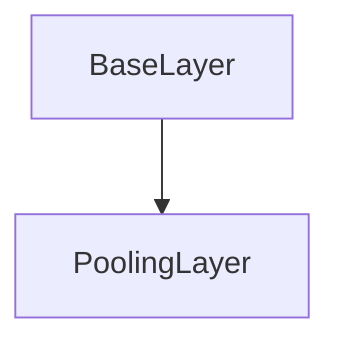

# PoolingLayer Class Documentation

[Return to `README`](/README.md)

The `PoolingLayer` class is a part of the `nn` namespace and is a template class that represents a pooling layer in a neural network.

## References

- [`Shape`](/docs/core/shape.md)
- [`BaseLayer`](/docs/layer/base.md)
- [`NodeLayer`](/docs/layer/node.md)

## Diagram


## Inheritance



## Pooling Types

- `PoolingType::max`: The max pooling type.
- `PoolingType::average`: The average pooling type.

## Template Parameters

- `P`: The pooling type of the layer.

## Template

- `PoolingLayer<PoolingType P>`

## Pooling Specializations

- `PoolingLayer<PoolingType::max>`
- `PoolingLayer<PoolingType::average>`

## Members

- `static const PoolingType type`: The pooling type of the layer.
- `Shape<3> pool`: The shape of the pooling window.
- `Shape<3> stride`: The stride of the pooling operation.
- `Shape<3> dilation`: The dilation of the pooling operation.

## Constructors

```
PoolingLayer( const Shape<3>& shape = Shape<3>( 0 ), const Shape<3>& stride = Shape<3>( 0 ), const Shape<3>& dilation = Shape<3>( 0 ) )
```
- Constructs a `PoolingLayer` with the specified shape, stride, and dilation.

## Destructors

```
virtual ~PoolingLayer()
```
- Destructs a `PoolingLayer`.

## Methods

### Reshape
```
void reshape( const Shape<3>& shape )
```
- Reshapes the `PoolingLayer` with the specified shape.

### Resize
```
void resize( const Shape<3>& shape )
```
- Resizes the `PoolingLayer` with the specified shape.

### Set Stride
```
void set_stride( const Shape<3>& stride )
```
- Sets the stride of the `PoolingLayer` to the specified value.

### Set Dilation
```
void set_dilation( const Shape<3>& dilation )
```
- Sets the dilation of the `PoolingLayer` to the specified value.

### Calculate Output Shape
```
Shape<5> calculate_output_shape( const Shape<5>& input_shape ) const
```
- Calculates the output shape of the `PoolingLayer` given the input shape.

### Get Shape
```
const Shape<3>& get_shape() const
```
- Returns the shape of the `PoolingLayer`.

### Get Stride
```
const Shape<3>& get_stride() const
```
- Returns the stride of the `PoolingLayer`.

### Get Dilation
```
const Shape<3>& get_dilation() const
```
- Returns the dilation of the `PoolingLayer`.

### Inference
```
template <typename U, typename V> Error inference( const NodeLayer<U>& input_layer, NodeLayer<V>& output_layer ) const requires ( P == PoolingType::max )
```
- Performs inference on the `PoolingLayer` with the max pooling type.

### Inference
```
template <typename U, typename V> Error inference( const NodeLayer<U>& input_layer, NodeLayer<V>& output_layer ) const requires ( P == PoolingType::average )
```
- Performs inference on the `PoolingLayer` with the average pooling type.

### Backpropagation
```
template <typename U, typename V> Error backpropagation( NodeLayer<U>& input_layer, const NodeLayer<V>& output_layer ) const requires ( P == PoolingType::max )
```
- Performs backpropagation on the `PoolingLayer` with the max pooling type.

### Backpropagation
```
template <typename U, typename V> Error backpropagation( NodeLayer<U>& input_layer, const NodeLayer<V>& output_layer ) const requires ( P == PoolingType::average )
```
- Performs backpropagation on the `PoolingLayer` with the average pooling type.

## Operators

### Stride Dilation Dimension
```
inline Dim stride_dilation_dim( const Dim in_dim, const Dim out_dim, const Dim stride_dim_size, const Dim dilation_dim_size ) const
```
- Calculates the stride dilation dimension for the pooling operation.

### Pooling Window
```
template <typename U> inline U pooling_window( const NodeLayer<U>& input_layer, const Idx in_b_idx, const Dim out_c_dim, const Dim out_z_dim, const Dim out_y_dim, const Dim out_x_dim ) const requires ( P == PoolingType::max )
```
- Calculates the max pooling window for the specified coordinates.

### Pooling Window
```
template <typename U> inline U pooling_window( const NodeLayer<U>& input_layer, const Idx in_b_idx, const Dim out_c_dim, const Dim out_z_dim, const Dim out_y_dim, const Dim out_x_dim ) const requires ( P == PoolingType::average )
```
- Calculates the average pooling window for the specified coordinates.

### Pooling Window Backpropagation
```
template <typename U> inline Idx pooling_window_backpropagation( NodeLayer<U>& input_layer, const Idx in_b_idx, const Dim out_c_dim, const Dim out_z_dim, const Dim out_y_dim, const Dim out_x_dim ) const requires ( P == PoolingType::max )
```
- Calculates the index of the max value in the pooling window for backpropagation.

### Pooling Window Backpropagation
```
template <typename U, typename V> inline void pooling_window_backpropagation( NodeLayer<U>& input_layer, const V scaled_output_delta, const Idx in_b_idx, const Dim out_c_dim, const Dim out_z_dim, const Dim out_y_dim, const Dim out_x_dim ) const requires ( P == PoolingType::average )
```
- Performs backpropagation on the average pooling window.

[Return to `README`](/README.md)