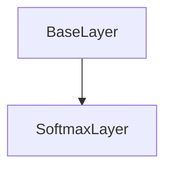

# SoftmaxLayer Class Documentation

[Return to `README`](/README.md)

The `SoftmaxLayer` class is a part of the `nn` namespace and represents a softmax layer in a neural network.

## References

- [`BaseLayer`](/docs/layer/base.md)
- [`NodeLayer`](/docs/layer/node.md)

## Diagram


## Inheritance



## Constructors

```
SoftmaxLayer()
```
- Constructs a `SoftmaxLayer` with no parameters.

## Destructors

```
virtual ~SoftmaxLayer()
```
- Destructs a `SoftmaxLayer`.

## Methods

### Inference
```
template <typename U, typename V>
Error inference( const NodeLayer<U>& input_layer, NodeLayer<V>& output_layer ) const
```
- Performs inference on the `SoftmaxLayer`.

### Backpropagation
```
template <typename U, typename V>
Error backpropagation( NodeLayer<U>& input_layer, const NodeLayer<V>& output_layer ) const
```
- Performs backpropagation on the `SoftmaxLayer`.

[Return to `README`](/README.md)